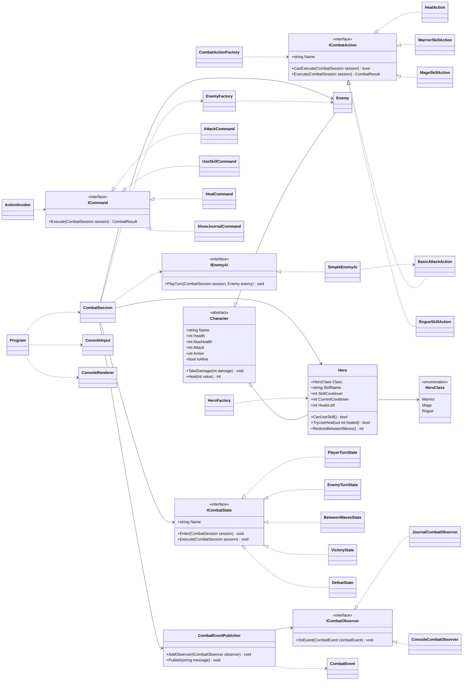
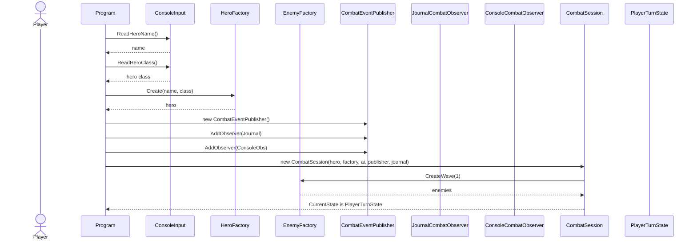
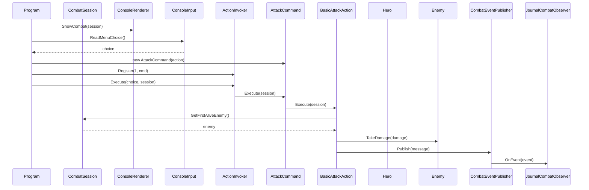
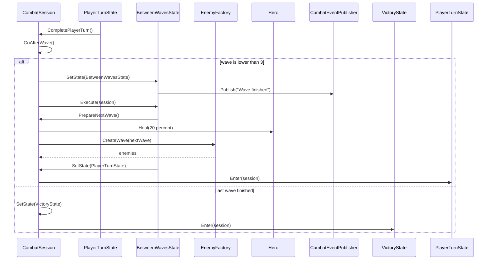

# CombatGame diagrams

## Class diagram

```mermaid
classDiagram
    direction LR

    class Character {
        <<abstract>>
        +string Name
        +int Health
        +int MaxHealth
        +int Attack
        +int Armor
        +bool IsAlive
        +TakeDamage(int damage) void
        +Heal(int value) int
    }

    class Hero {
        +HeroClass Class
        +string SkillName
        +int SkillCooldown
        +int CurrentCooldown
        +int HealsLeft
        +CanUseSkill() bool
        +TryUseHeal(out int healed) bool
        +RestoreBetweenWaves() int
    }

    class Enemy

    class HeroClass {
        <<enumeration>>
        Warrior
        Mage
        Rogue
    }

    class ICombatAction {
        <<interface>>
        +string Name
        +CanExecute(CombatSession session) bool
        +Execute(CombatSession session) CombatResult
    }

    class BasicAttackAction
    class HealAction
    class WarriorSkillAction
    class MageSkillAction
    class RogueSkillAction
    class CombatActionFactory

    class IEnemyAi {
        <<interface>>
        +PlayTurn(CombatSession session, Enemy enemy) void
    }

    class SimpleEnemyAi

    class ICommand {
        <<interface>>
        +Execute(CombatSession session) CombatResult
    }

    class AttackCommand
    class UseSkillCommand
    class HealCommand
    class ShowJournalCommand
    class ActionInvoker

    class ICombatState {
        <<interface>>
        +string Name
        +Enter(CombatSession session) void
        +Execute(CombatSession session) void
    }

    class PlayerTurnState
    class EnemyTurnState
    class BetweenWavesState
    class VictoryState
    class DefeatState

    class CombatEventPublisher {
        +AddObserver(ICombatObserver observer) void
        +Publish(string message) void
    }

    class ICombatObserver {
        <<interface>>
        +OnEvent(CombatEvent combatEvent) void
    }

    class JournalCombatObserver
    class ConsoleCombatObserver
    class CombatEvent

    class HeroFactory
    class EnemyFactory
    class CombatSession
    class ConsoleInput
    class ConsoleRenderer
    class Program

    Character <|-- Hero
    Character <|-- Enemy
    Hero --> HeroClass

    ICombatAction <|.. BasicAttackAction
    ICombatAction <|.. HealAction
    ICombatAction <|.. WarriorSkillAction
    ICombatAction <|.. MageSkillAction
    ICombatAction <|.. RogueSkillAction
    CombatActionFactory ..> ICombatAction

    IEnemyAi <|.. SimpleEnemyAi
    SimpleEnemyAi ..> BasicAttackAction

    ICommand <|.. AttackCommand
    ICommand <|.. UseSkillCommand
    ICommand <|.. HealCommand
    ICommand <|.. ShowJournalCommand
    ActionInvoker ..> ICommand

    ICombatState <|.. PlayerTurnState
    ICombatState <|.. EnemyTurnState
    ICombatState <|.. BetweenWavesState
    ICombatState <|.. VictoryState
    ICombatState <|.. DefeatState

    ICombatObserver <|.. JournalCombatObserver
    ICombatObserver <|.. ConsoleCombatObserver
    CombatEventPublisher --> ICombatObserver
    CombatEventPublisher ..> CombatEvent

    HeroFactory ..> Hero
    EnemyFactory ..> Enemy

    CombatSession --> Hero
    CombatSession --> Enemy
    CombatSession --> ICombatState
    CombatSession --> CombatEventPublisher
    CombatSession ..> EnemyFactory
    CombatSession ..> IEnemyAi
    Program ..> CombatSession
    Program ..> ConsoleInput
    Program ..> ConsoleRenderer
```

## Game start sequence

```mermaid
sequenceDiagram
    actor Player
    participant Program
    participant Input as ConsoleInput
    participant HF as HeroFactory
    participant EF as EnemyFactory
    participant Pub as CombatEventPublisher
    participant Journal as JournalCombatObserver
    participant ConsoleObs as ConsoleCombatObserver
    participant Session as CombatSession
    participant State as PlayerTurnState

    Program->>Input: ReadHeroName()
    Input-->>Program: name
    Program->>Input: ReadHeroClass()
    Input-->>Program: hero class
    Program->>HF: Create(name, class)
    HF-->>Program: hero

    Program->>Pub: new CombatEventPublisher()
    Program->>Pub: AddObserver(Journal)
    Program->>Pub: AddObserver(ConsoleObs)

    Program->>Session: new CombatSession(hero, factory, ai, publisher, journal)
    Session->>EF: CreateWave(1)
    EF-->>Session: enemies
    Session-->>Program: CurrentState is PlayerTurnState
```

## Player turn sequence

```mermaid
sequenceDiagram
    participant Program
    participant Session as CombatSession
    participant Renderer as ConsoleRenderer
    participant Input as ConsoleInput
    participant Invoker as ActionInvoker
    participant Cmd as AttackCommand
    participant Action as BasicAttackAction
    participant Hero
    participant Enemy
    participant Pub as CombatEventPublisher
    participant Journal as JournalCombatObserver

    Program->>Renderer: ShowCombat(session)
    Program->>Input: ReadMenuChoice()
    Input-->>Program: choice
    Program->>Cmd: new AttackCommand(action)
    Program->>Invoker: Register(1, cmd)
    Program->>Invoker: Execute(choice, session)

    Invoker->>Cmd: Execute(session)
    Cmd->>Action: Execute(session)
    Action->>Session: GetFirstAliveEnemy()
    Session-->>Action: enemy
    Action->>Enemy: TakeDamage(damage)
    Action->>Pub: Publish(message)
    Pub->>Journal: OnEvent(event)
```

## End of wave sequence

```mermaid
sequenceDiagram
    participant Session as CombatSession
    participant PlayerState as PlayerTurnState
    participant State as BetweenWavesState
    participant EF as EnemyFactory
    participant Hero
    participant Pub as CombatEventPublisher
    participant Victory as VictoryState
    participant PlayerTurn as PlayerTurnState

    PlayerState->>Session: CompletePlayerTurn()
    Session->>Session: GoAfterWave()

    alt wave is lower than 3
        Session->>State: SetState(BetweenWavesState)
        State->>Pub: Publish("Wave finished")
        Session->>State: Execute(session)
        State->>Session: PrepareNextWave()
        Session->>Hero: Heal(20 percent)
        Session->>EF: CreateWave(nextWave)
        EF-->>Session: enemies
        State->>Session: SetState(PlayerTurnState)
        Session->>PlayerTurn: Enter(session)
    else last wave finished
        Session->>Session: SetState(VictoryState)
        Session->>Victory: Enter(session)
    end
```
