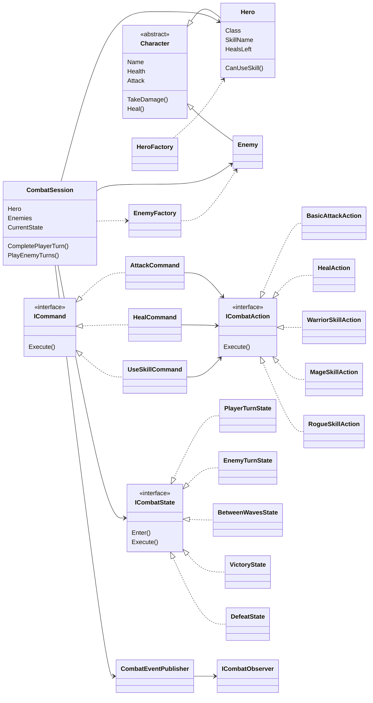
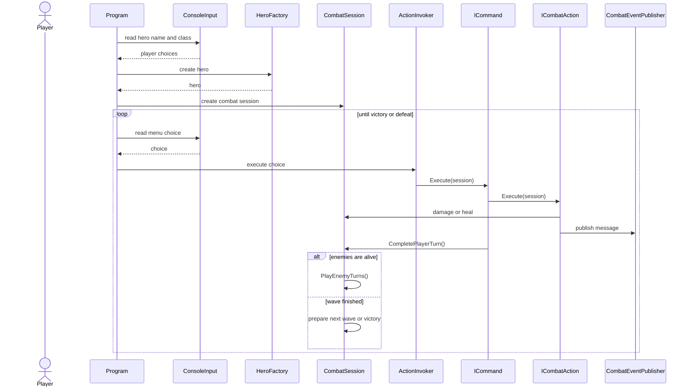

# Diagrammes minimalistes CombatGame

Ces diagrammes sont volontairement simples. Le but est surtout de comprendre les grandes parties du projet sans montrer toutes les classes.

## Diagramme de classe minimaliste

## Diagramme de sequence minimaliste

